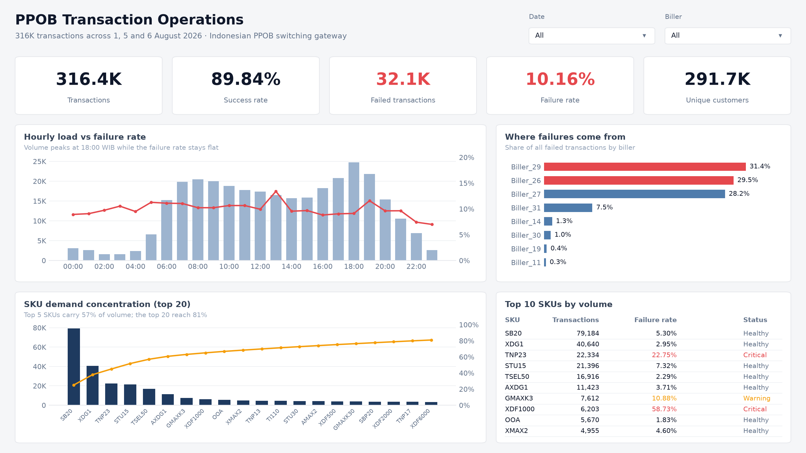
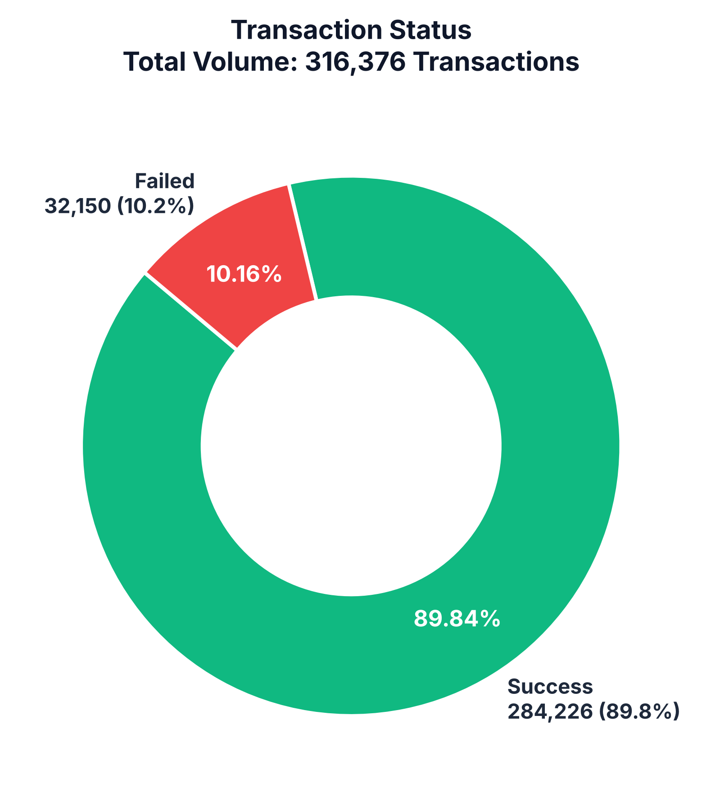
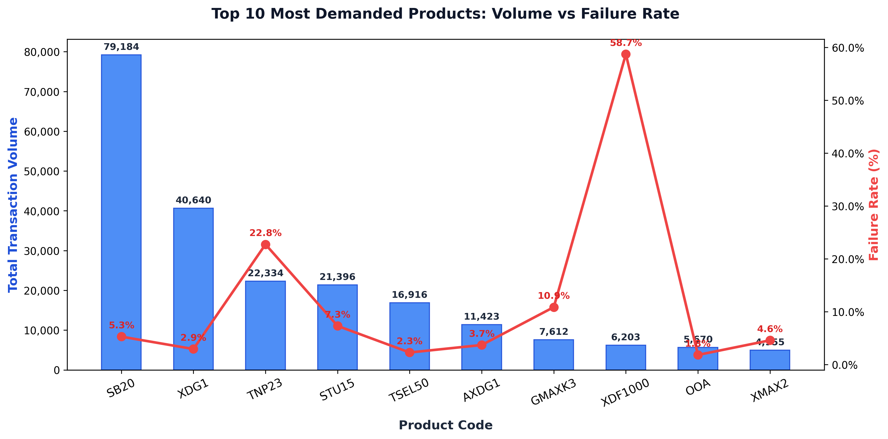
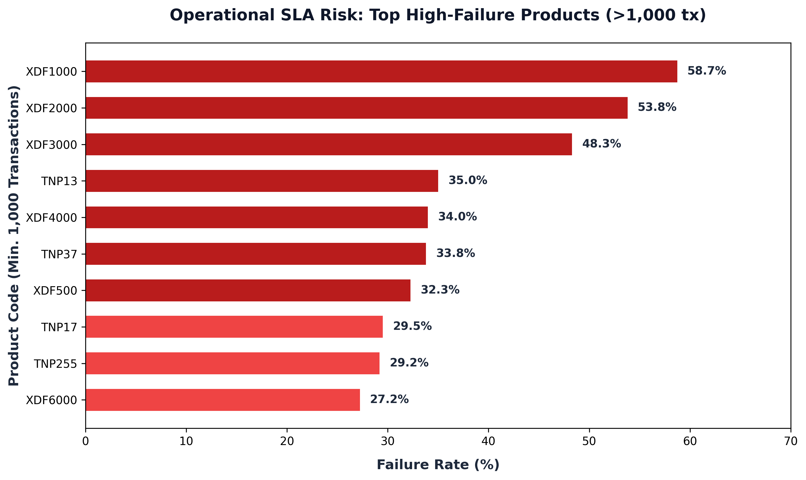
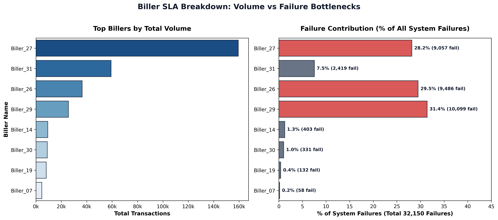
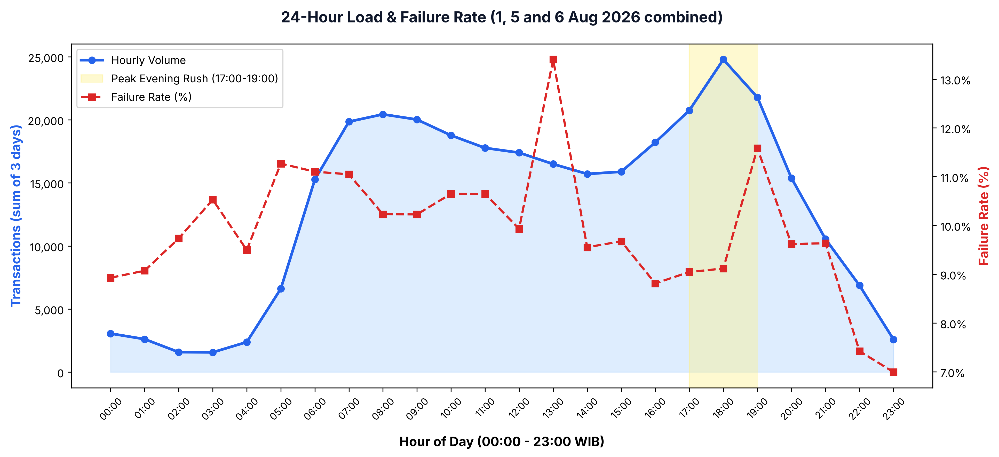
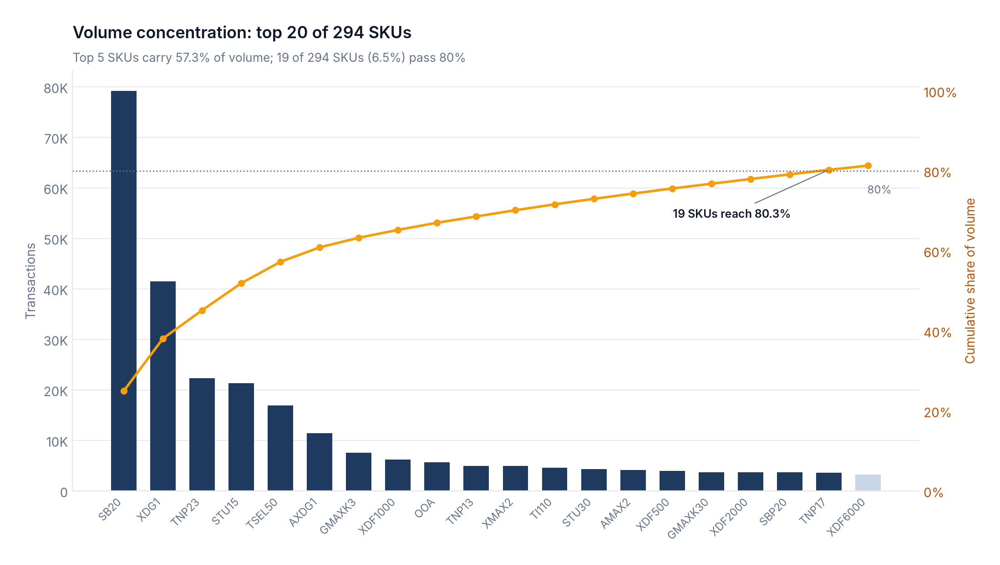

# Fintech PPOB Transaction Operations Analytics

End-to-end analysis of **316,376 transactions** from an Indonesian PPOB (Payment Point Online Bank) switching gateway,
covering failure root causes, vendor SLA, demand concentration and peak-load behaviour. Delivered as a Power BI
dashboard, a SQL and Python analysis, and an executive deck.




## Key findings

| Metric | Value |
|---|---|
| Transactions analysed | 316,376 (1, 5 and 6 August 2026) |
| Success rate | 89.84% |
| Failed transactions | 32,150 (10.16%) |
| Failures from just two billers | 60.9% (`Biller_29`, `Biller_26`) on 19.6% of traffic |
| Busiest hour | 18:00 WIB, 24,787 transactions |
| Active ecosystem | 46 partners · 31 billers · 318 SKUs · 291,662 customers |

1. **Failures are a vendor problem, not a capacity problem.** `Biller_29` (39.4% failure rate) and `Biller_26` (26.0%)
   produce 60.9% of all failures. The hourly failure rate stays within roughly 7–13% even at peak load.
2. **A few denominations are broken.** Among SKUs with at least 1,000 transactions, `XDF1000` fails 58.7% of the time,
   `XDF2000` 53.8% and `TNP13` 35.0%, which points to catalogue desynchronisation or retired denominations upstream.
3. **Demand is highly concentrated.** The top 5 SKUs carry 57% of volume and the top 20 carry 81%, so monitoring a
   short SKU list protects most revenue. `TNP23`, the #3 SKU by volume, fails 22.8% of the time.
4. **Two daily peaks.** Morning (07:00–09:00, about 20K transactions/hour) and evening (17:00–19:00, 21.3% of daily volume).
   01:00–04:00 is the quietest window and suits batch reconciliation.

## Recommendations

| Priority | Action | Expected impact |
|---|---|---|
| P1 | Smart fallback routing: reroute traffic when a biller's error rate exceeds 10% in a 5-minute window | Recovers a large share of the ~19.6K failures from the two critical billers |
| P2 | Automatic retry with backoff on transient errors for top SKUs (`TNP23`, `STU15`) | Higher checkout conversion |
| P3 | SLA clauses and deposit-balance alerts for `Biller_29` and `Biller_26` | Vendor accountability |
| P4 | Auto-scale gateway workers for 16:30–20:00 WIB | Stable latency at peak |

## Deliverables

| Deliverable | Location | How to use |
|---|---|---|
| Power BI dashboard (2 pages) | [`powerbi/`](powerbi/) | Open `PPOB_Transaction_Operations.pbip` in Power BI Desktop, see [setup](powerbi/README.md) |
| Interactive web dashboard | [`dashboard/index.html`](dashboard/index.html) | Open the file in any browser |
| SQL analysis | [`sql/queries.sql`](sql/queries.sql) | CTEs, window functions, Pareto queries on the SQLite DB |
| Python analysis and charts | [`src/`](src/), [`visualizations/`](visualizations/) | `pip install -r requirements.txt` then `python src/analysis_and_charts.py` |
| Executive deck | [`presentations/`](presentations/) | 10-slide summary for stakeholders |

<details>
<summary>Analysis charts</summary>








</details>

## Project structure

```
.
├── powerbi/          Power BI project: semantic model (TMDL), report (PBIR), theme, previews
├── dashboard/        Standalone HTML dashboard
├── data/
│   ├── raw/          Masked transaction data (CSV, XLSX)
│   └── database/     Cleaned SQLite database with indexes and views
├── sql/              Analytical SQL queries
├── src/              Python analysis and deck generator
├── visualizations/   Exported charts
├── metrics/          KPI summary (JSON)
└── presentations/    Executive deck (PPTX)
```

## Data and privacy

Customer numbers, biller, partner and personal names are pseudonymised with deterministic hashing. The mapping file
is excluded from version control.

## Author

**Novaldi Ramadhan Waluyo**, Data & Operations Analyst
[novaldiramadhan28@gmail.com](mailto:novaldiramadhan28@gmail.com) · [github.com/Achimedes28](https://github.com/Achimedes28)
