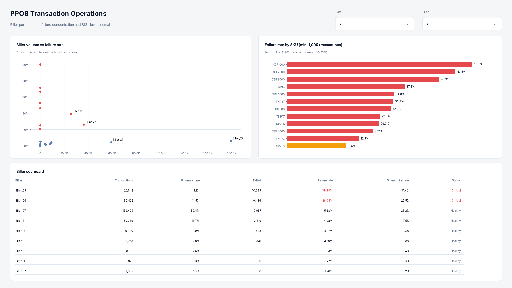

# Power BI Dashboard

A two-page Power BI report built on a star-schema model of the 316,376 masked PPOB transactions in `data/raw/`.
It is saved as a **Power BI Project (`.pbip`)**, so the model, DAX and report layout are plain text and reviewable in Git.

| Page | What it answers |
|---|---|
| **Overview** | How healthy is the gateway, when does load peak, which billers cause failures, how concentrated is SKU demand? |
| **Biller & SKU Diagnostics** | Which vendors and SKUs breach SLA, and by how much? |




> The images above are static renders of the report layout built from the same data and theme by
> [`src/render_powerbi_preview.py`](../src/render_powerbi_preview.py).

## Open the report

Requirements: Power BI Desktop (Windows), recent version. If your build does not open `.pbip` files yet, enable
*File → Options → Preview features → Power BI Project (.pbip) save option* and *Store reports using enhanced metadata format (PBIR)*.

1. Clone or download this repository.
2. Open `powerbi/PPOB_Transaction_Operations.pbip`.
3. Go to *Transform data → Edit parameters* and set **ProjectFolder** to the folder you cloned into,
   for example `C:\Users\you\Documents\fintech-ppob-transaction-operations-analytics`.
4. Click **Refresh**. The model loads the CSV from `data/raw/` (about 316K rows).
5. Optional: *File → Save as* `.pbix` if you want a single file to share.

## Folder layout

```
powerbi/
├── PPOB_Transaction_Operations.pbip            # open this in Power BI Desktop
├── PPOB_Transaction_Operations.SemanticModel/  # model in TMDL (tables, relationships, DAX)
├── PPOB_Transaction_Operations.Report/         # report in PBIR (pages and visuals as JSON)
├── theme/PPOB_Minimal.json                     # report theme, importable on its own
└── preview/                                    # static page images used in the READMEs
```

## Data model

```
             Dim_Date      Dim_Hour
                 \            /
 Dim_Biller ── Fact_Transactions ── Dim_Product
                      |
                 Dim_Partner          _Measures (DAX only)
```

| Table | Grain | Notes |
|---|---|---|
| `Fact_Transactions` | one row per transaction | Status lower-cased, `Hour` derived from the request timestamp, customer ID hidden |
| `Dim_Date` | day | `Date Label` sorted by date |
| `Dim_Hour` | hour 0–23 | `Time Band`: Morning Rush (07–09), Evening Peak (17–19), Off-Peak (01–04), Regular |
| `Dim_Biller`, `Dim_Partner` | biller / partner | |
| `Dim_Product` | SKU | `Volume Rank` calculated column drives the top-N visuals |

All relationships are many-to-one, single direction, from the fact table to each dimension.

## DAX measures

| Folder | Measure | Definition |
|---|---|---|
| Volume | `Total Transactions` | `COUNTROWS ( Fact_Transactions )` |
| | `Successful Transactions` / `Failed Transactions` | `CALCULATE ( [Total Transactions], Fact_Transactions[Status] = "success" / "failed" )` |
| | `Unique Customers`, `Active Billers`, `Active SKUs` | `DISTINCTCOUNT` of the matching column |
| | `Peak Hour Volume` | `MAXX ( VALUES ( Dim_Hour[Hour] ), [Total Transactions] )` |
| SLA | `Success Rate %`, `Failure Rate %` | share of transactions by status |
| | `Failure Share %` | failures of the current biller / SKU as a share of all failures (biller, SKU and partner filters removed) |
| | `Volume Share %` | same idea for volume |
| | `SLA Status` | `Critical` above 20% failure, `Warning` from 10%, otherwise `Healthy` |
| | `SLA Color` | hex colour for the same thresholds, used for conditional bar colours |
| Pareto | `Cumulative Volume %` | running share of volume with SKUs ranked from largest to smallest |

The full expressions live in
[`_Measures.tmdl`](PPOB_Transaction_Operations.SemanticModel/definition/tables/_Measures.tmdl).

## Theme

`theme/PPOB_Minimal.json` uses a light grey canvas, white cards with a thin border, navy as the single accent
and red / amber only for SLA breaches. Import it into any report via *View → Themes → Browse for themes*.
